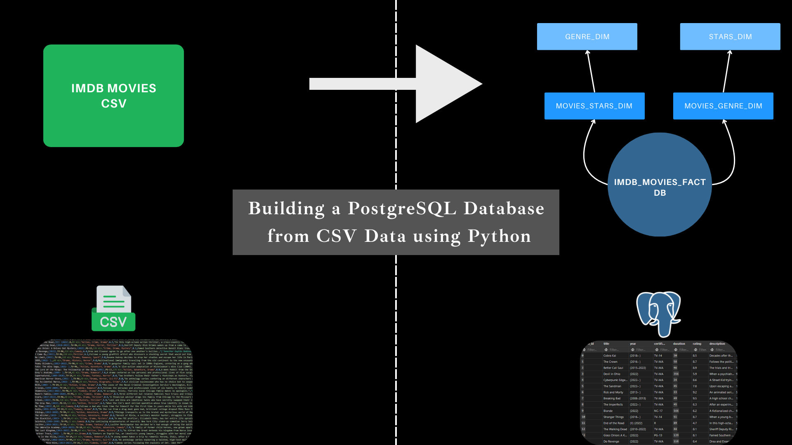

# Building a PostgreSQL Database from IMDb Movies CSV Data

## Introduction
This project was developed to gain a deeper understanding of database infrastructure design, with a particular focus on PostgreSQL. It provides an opportunity to explore key concepts in data modeling, relational database design, and performance optimization.

The main objective was to take raw IMDb movie data stored in a CSV file, clean and transform it, and then structure it into a well-organized relational database schema. After implementing the database structure, I also aimed to optimize the schema for efficient querying, ensuring faster performance for complex queries involving joins.

## Preparing the csv data
The first challenge in this project was the structure of the initial CSV file. The file contained columns where the values in each row represented collections of items, resembling lists. This unstructured format is not ideal for relational databases, which prefer data to be normalized into separate tables with defined relationships.

To address this, I implemented a relational database schema, where the list-based columns were broken down into separate tables. These new tables were then connected using primary and foreign key relationships, effectively normalizing the data and improving the structure.

The final relational design consists of five interconnected tables. This normalization process ensures that the data is stored in a way that eliminates redundancy, while also improving data integrity and the efficiency of query execution.

Additionally, some values in the dataset were incorrectly formatted or fell outside the expected range. These inconsistencies were cleaned and corrected during the data preparation phase. The cleaned and transformed tables are all included in the Jupyter Lab file, where the modifications can be reviewed. Once all issues were addressed, the final tables were exported as CSV files and stored in the "csv_tables" directory for further use.

## Creating the database infrastructure

When designing the database infrastructure, I followed the data types specified in the DataFrames. This design was carefully planned to ensure optimal query performance, particularly for queries involving joins between multiple tables.

The process began by creating the necessary database structure in PostgreSQL, which was hosted locally on my machine using pgAdmin 4. The creation script is stored in the "3_csv_to_tables.sql" file within the "sql_loader" folder. This script loads the data into the database in a logical sequence, ensuring that each table is populated correctly and all relationships are properly established.

After the database infrastructure was set up and the data was loaded, I tested the database by running several queries. These queries were designed to extract useful insights and validate that the database was functioning as expected.

## Testando a table realizando algumas queries

In the "sql_queries" folder, I created three queries aimed at testing the database functionality and generating some interesting insights:

- Count of Movies by Genre and Average Rating per Genre: This query calculates how many movies exist in each genre and provides the average rating for each genre.
- Top Movies by Community Votes and Average Rating: This query identifies the movies with the highest number of community votes and provides their average ratings.
- Top Movie Stars by Average Rating of Their Work: This query identifies the movie stars with the highest average ratings across the movies they have starred in.

By running these queries, I was able to confirm that the database is fully functional and well-structured, capable of returning valuable insights based on the IMDb movie dataset.

## Conclusão
In conclusion, this project successfully demonstrates the process of transforming a raw CSV dataset into a well-organized relational database. Through careful data cleaning, normalization, and schema design, I was able to create a robust PostgreSQL database optimized for query performance. The database was tested with several queries, which confirmed its integrity and functionality.

The full implementation, including data transformation, database schema creation, and SQL queries, can be reviewed in the provided Jupyter Lab file and the SQL scripts stored in the project directory. The final structure is designed to handle large amounts of data efficiently and provide valuable insights into IMDb movies and stars.